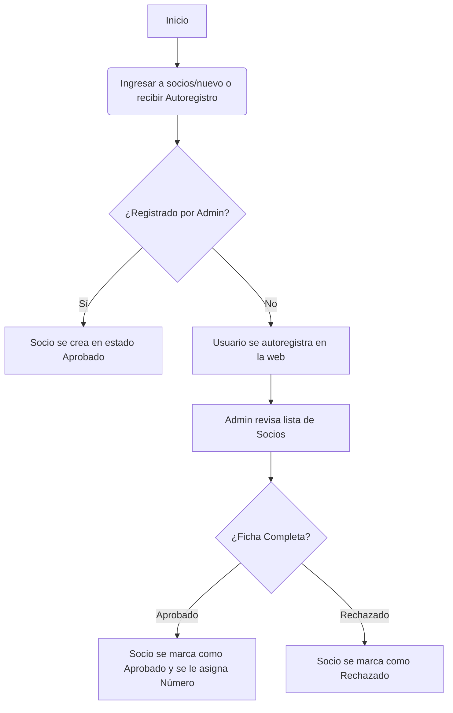
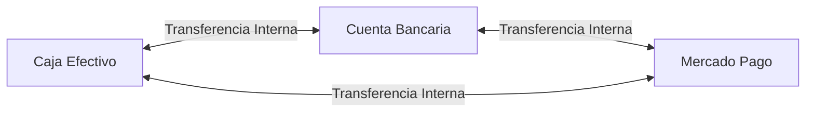
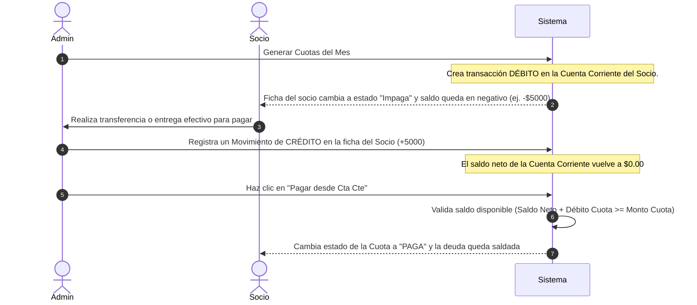

# Manual del Usuario Administrador y Usuario Final 📖

Este documento detalla los flujos de trabajo clave, pantallas y configuraciones para los dos perfiles del sistema: el **Usuario Administrador** y el **Usuario Final (Socio)**.

---

## 🛠️ PARTE 1: Manual del Administrador

El Administrador tiene el control total sobre la administración de socios, el manejo de caja y tesorería, la aprobación de usuarios y el mantenimiento del sistema.

### 1. Flujo de Alta y Aprobación de Socios
Este flujo garantiza que cualquier socio registrado en la base de datos tenga una ficha detallada y pase por una revisión administrativa.

#### **Pasos del Flujo de Registro:**

#### **Instrucciones:**
* **Alta Directa (Admin):** Ve a **Socios** -> **+ Cargar Nueva Ficha**. Rellena los datos (por defecto el tipo de documento es **DNI**). Al crearlo por aquí, queda aprobado de inmediato.
* **Aprobación de Solicitudes:** Los socios que completen un formulario de inscripción web quedan en estado `Pendiente`. En la pantalla **Socios**, haz clic en el botón verde **Aprobar** o en el botón rojo **Rechazar**. Al aprobarse, el sistema calcula y asigna automáticamente el siguiente número correlativo disponible.

---

### 2. Vinculación de Socio con Usuario Web
Para que un socio pueda ver sus cuotas, transacciones y novedades en la web, su ficha de socio debe estar vinculada a una cuenta de usuario web (por medio de su correo electrónico).

* Cuando un socio se autoregistra, se crea una cuenta web con su email.
* Si el Administrador crea la ficha del socio en la administración, debe asegurarse de colocar el **mismo email** que el socio usó en su registro web.
* El sistema vinculará automáticamente la cuenta web al socio basándose en el campo `email`. El socio verá instantáneamente su panel personal al iniciar sesión.

---

### 3. Flujo de Caja, Tesorería y Balance General
El sistema cuenta con un Libro Diario para registrar todo el movimiento monetario del club a través de tres cuentas físicas/virtuales: **Caja Efectivo**, **Cuenta Bancaria** y **Mercado Pago**.

#### **Acciones Disponibles:**
* **Registrar Movimiento de Caja:** Permite registrar cobros de buffet, alquiler de salón, donaciones (`INGRESO`) o compras de suministros, sueldos, servicios (`EGRESO`).
* **Transferencia entre Cuentas Propias:** Permite mover dinero entre las cuentas del club sin afectar el balance total general de la tesorería (ej. depositar efectivo recaudado en el banco).
* **Balance General por Categorías:** Muestra una tabla comparativa en tiempo real de todos los ingresos y egresos consolidados por cada categoría conceptual, calculando el superávit o déficit total del ejercicio.

---

### 4. Generación Mensual de Cuotas
Cada mes, el Administrador debe generar las cuotas para recaudar fondos.

> [!IMPORTANT]
> **Regla de Validación Antiglobo:**
> El proceso de generación de cuotas mensuales **no se ejecutará** si existen clasificaciones de socios activos y aprobados que no cuenten con una cuota configurada para el período en curso. Esto evita facturaciones en cero o cobros desactualizados.

#### **Pasos para Generar las Cuotas:**
1. Ve al **Dashboard** (Panel de Control).
2. Si aparece un aviso de color amarillo advirtiendo que faltan tarifas para ciertas clasificaciones activas, haz clic en el enlace adjunto para ir a configurarlas.
3. Una vez configuradas todas, el botón **Generar Cuotas del Mes** estará habilitado en el Dashboard.
4. Presiona el botón y confirma el diálogo interactivo de **SweetAlert2**. El sistema registrará de forma automática una transacción de tipo `DEBITO` en la cuenta corriente de cada socio según su clasificación.

---

### 5. Copias de Seguridad (Backups)
Para resguardar la información ante fallos o migraciones:
1. Ve al Dashboard.
2. Desplázate hasta la sección **Copia de Seguridad de Base de Datos** (abajo).
3. Haz clic en **Generar Backup**. Se creará un punto de restauración local en la carpeta `backups` y el archivo se descargará automáticamente a tu equipo.
4. Puedes descargar copias previas de la lista histórica allí mismo.

---

## 👤 PARTE 2: Manual del Usuario Final (Socio)

El socio cuenta con un portal interactivo para gestionar su perfil, visualizar su estado de cuenta corriente y estar al día con las novedades del club.

### 1. Panel de Novedades (Inicio)
Al iniciar sesión, el socio accede a la cartelera pública del club con novedades, anuncios y eventos redactados por la comisión directiva.

### 2. Mi Ficha Personal
En la sección **Mi Ficha**, el socio puede:
* Visualizar su número de socio, categoría, estado y datos de contacto.
* Cambiar su contraseña de acceso web de forma segura.

### 3. Mi Cuenta Corriente (Cta Cte)
La Cuenta Corriente es el centro financiero del socio:
* **Saldo Disponible:** Indica el estado financiero del socio con el club.
  * Un saldo **negativo** (ej: `-$5.000,00`) indica que adeuda dinero (debitos cargados sin saldar).
  * Un saldo en **cero** (`$0,00`) indica que está al día.
  * Un saldo **positivo** (ej: `+$2.000,00`) indica que posee saldo a favor que puede aplicar en futuros cobros.
* **Historial de Movimientos:** Detalla en orden cronológico los débitos (cuotas mensuales cargadas) y los créditos (pagos realizados en efectivo, transferencias bancarias o Mercado Pago).

---

## 🔀 PARTE 3: Flujo Completo de Cobro de Cuota (Caso de Uso Común)

Para entender cómo operan ambos perfiles en conjunto, revisemos el ciclo de facturación y cobro:

1. **Generación:** El Administrador genera la cuota. El socio ve que debe $5000 y su saldo en Cta Cte es de `-$5000`.
2. **Pago del socio:** El socio realiza el pago y envía el comprobante al club.
3. **Acreditación:** El Administrador registra el pago del socio como un movimiento de **CRÉDITO** en su Cuenta Corriente (ej: $5000). El saldo neto del socio vuelve a ser `$0`.
4. **Cierre de cuota:** El Administrador hace clic en **Pagar desde Cta Cte** en la cuota pendiente del socio. El sistema aplica los créditos disponibles, marca la cuota como **Paga** de forma definitiva y mantiene su saldo corriente en `$0.00` sin duplicar transacciones.
